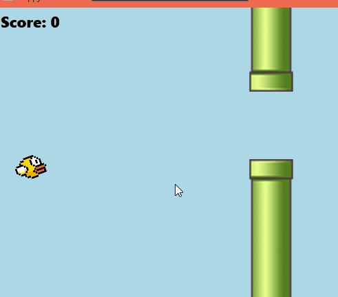
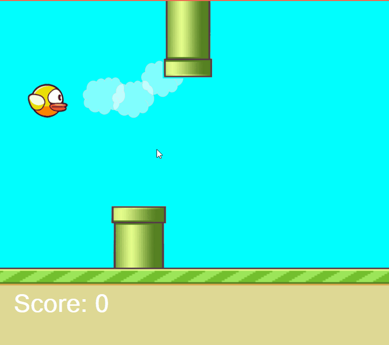

# Flappy-Bird-Improved Using C# and XAML

So after working on the older version of [Flappy Bird](https://github.com/agent1red/FlappyBird-CSharp) using basic C# and WinForms, I went ahead and took it to the next level  
using WPF and XAML coding. This was interesting to me because I was able to design the Form using XAML for markup  
much like HTML. It was easier for me to visualize and use databinding. I researched into WPF and found that I can add   
objects in XAML and bind them to controls like media players. Placing objects at the start of the game was much easier than  
in WinForms as I was able to reference each object Image and loop through them with minimal code. 

# Completed Project

Here is a gif of the game running. There is audio sound effects and background music. If you want to experience that then 
you can can clone or fork my repo. 

Here is the older one that was my first attempt with WinForms. You can see the difference in technology. Here I was having  
a harder time with the Image objects on the screen. I only had background music playing and no sound effects. 

